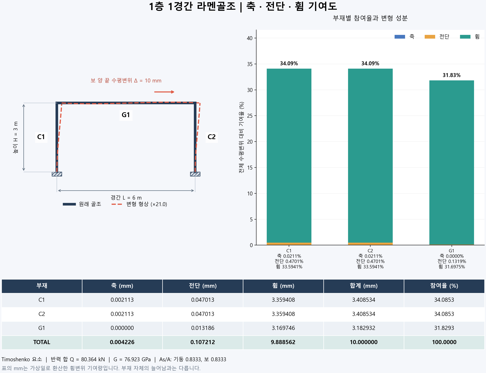

# 1층 1경간 라멘골조: 축·전단·휨 가상일 기여도

다층·다경간 확장은 [MULTI_FRAME_GUIDE.md](MULTI_FRAME_GUIDE.md)를 참조하세요. `python multi_frame.py --examples`로 1층 1경간, 2층 2경간, 3층 3경간의 표와 성분별 portion %가 표시된 그림을 생성합니다.

## 1. 변경 사항

전단변형을 포함하는 **Timoshenko 요소**로 변경했습니다. 이전 Euler–Bernoulli 결과에 전단 항만 더하지 않고 강성행렬, 부재력, 에너지, 변형 형상을 모두 같은 모델로 계산합니다. 따라서 이전 버전과 반력 및 참여율이 조금 다릅니다.

부재명은 **C1=왼쪽 기둥, C2=오른쪽 기둥, G1=보**입니다. 축·전단·휨별 기여량(m), 전체 지정 변위 대비 비율(%), 에너지(J)를 저장합니다. 표에는 합계 행도 표시합니다.

## 2. 실행 방법

Python 3.9 이상에서 아래를 실행합니다. 패키지가 설치되어 있으면 첫 줄은 생략합니다.

```bash
python -m pip install numpy matplotlib
python frame_analysis.py
```

NumPy로 직접 해석하고 Matplotlib은 그림에만 사용합니다. 결과는 코드 옆 results 폴더에 저장되며 재실행 시 갱신됩니다.

| 파일 | 내용 |
|---|---|
| frame_analysis.py | STEP 1~8로 구분한 전체 코드 |
| results/results_summary.md | 성분별 기여량 및 비율 표 |
| results/participation.png | 골조·변형·부재명·치수·막대그래프·수치 표 |
| results/participation.svg | 같은 그림의 벡터 파일 |
| results/baseline.csv | 성분별 기여량, 비율, 에너지, TOTAL 행 |
| results/nodal_results.csv | 절점 변위·회전·반력 |
| results/beam_stiffness_sweep.csv | 보 I 배율별 비교 |
| results/beam_stiffness_sweep.png | 보 I 변화에 따른 참여율 그림 |
| results/asymmetric.csv | 좌측 기둥 I를 0.5배로 한 비교 |
| results/verification.json | 입력·반력·횡강성·검증 |

한국어 그림은 맑은 고딕, 나눔고딕, Noto Sans CJK KR 중 설치된 글꼴을 사용합니다. 다른 환경에서는 이 중 하나가 필요합니다.

## 3. 모델과 입력

```text
          C (2) ─── G1 ─── D (3)       → Δ
          │                │
         C1               C2           H
          │                │
          A (0)            B (1)
         완전고정          완전고정
                  L
```

| Parameters 필드 | 기본값 | 의미 |
|---|---:|---|
| span / height | 6 / 3 m | 경간 / 층고 |
| E | 200×10⁹ Pa | 탄성계수 |
| nu | 0.3 | 포아송비 |
| column_A / beam_A | 각 0.02 m² | 단면적 |
| column_I / beam_I | 각 8×10⁻⁵ m⁴ | 단면2차모멘트 |
| column_shear_factor / beam_shear_factor | 각 5/6 | 유효전단면적 비율 As/A |
| delta | 0.01 m | 보 양 끝 지정 수평변위 |
| left_I_factor / right_I_factor | 각 1 | 좌우 기둥 I 배율 |

G=E/[2(1+nu)], As=shear_factor×A입니다. **5/6은 예제 가정**이며 모든 단면에 적용되는 값이 아닙니다. 실제 단면의 As를 알면 shear_factor=As/A로 설정합니다. 특히 H형강 등에서는 적합한 유효전단면적을 사용해야 합니다. 기본 A,I도 특정 상용 단면을 선정한 값은 아닙니다.

절점 자유도는 수평 ux, 수직 uy, 반시계방향 회전 θ입니다. A,B는 완전고정입니다. C,D의 ux만 Δ로 지정하고 uy,θ는 해석합니다. 따라서 보는 강체가 아니며 휨·전단변형이 발생합니다. 보 양 끝 ux가 같으므로 이 선형 모델에서 보의 축변형은 0입니다.

선형탄성·소변형·강접합·등단면을 가정합니다. 부재 중간 하중, 중력, 온도, 초기변형, 지점침하, P–Δ, 소성은 포함하지 않습니다. 단위는 N, m, Pa, rad입니다.

## 4. 기여도 정의

실제 변위를 유지하는 수평 구동력의 합을 Q라 합니다. 그 반력 패턴을 정규화하여 합력 P*=1 N인 가상하중을 만들고, C,D의 수평변위 지정을 해제한 골조에 적용합니다. 실제 부재력을 N,V,M, 가상 부재력을 n,v,m이라 하면:

$$C_{N,e}=\frac{1}{P^*}\int_0^{L_e}\frac{N_en_e}{EA}\,dx$$
$$C_{V,e}=\frac{1}{P^*}\int_0^{L_e}\frac{V_ev_e}{GA_s}\,dx$$
$$C_{M,e}=\frac{1}{P^*}\int_0^{L_e}\frac{M_em_e}{EI}\,dx$$
$$C_e=C_{N,e}+C_{V,e}+C_{M,e},\qquad\sum_e C_e=\Delta$$

적분 자체는 가상일(N·m)이며 P*로 나눈 C는 변위(m)입니다. 코드에서는 P*의 수치가 1이므로 나눗셈을 생략합니다. 부재 및 성분 비율의 분모는 모두 **전체 지정 변위 Δ**입니다.

$$\eta_e=100C_e/\Delta,\qquad\eta_{V,e}=100C_{V,e}/\Delta$$

부재 내부 성분 비율을 원한다면 100×C_component/C_e로 별도 계산합니다. 기본 표는 전체 골조 기준입니다. 이번 비례 상태에서는 다음 에너지 관계도 성립합니다.

$$U_e=\frac12\int\left(\frac{N^2}{EA}+\frac{V^2}{GA_s}+\frac{M^2}{EI}\right)dx
=\frac12u_e^Tk_eu_e$$
$$C_e=2U_e/Q,\qquad\eta_e=100U_e/\sum U_e$$

기여량은 **관심 횡변위에 대한 가상일 환산량**입니다. G1의 휨 기여량이 보 자체의 수평 늘어남을 의미하지는 않습니다. active는 이 참여율이 크다는 뜻이며 응력·파괴 위험 순위와 다릅니다.

## 5. 단계별 코드 읽기

### STEP 1 — Parameters, make_model

입력과 절점·부재를 만듭니다. 자유도는 A=[0,1,2], B=[3,4,5], C=[6,7,8], D=[9,10,11]입니다. 내부 요소 순서는 C1,G1,C2이고 표는 C1,C2,G1 순서입니다.

### STEP 2 — local_stiffness, assemble

전단 유연성 매개변수 φ=12EI/(GA_s L²)를 사용합니다. 국부 자유도 순서는 [ui,vi,θi,uj,vj,θj]이며 강성계수는 다음과 같습니다.

$$a=EA/L,\quad b=\frac{12EI}{L^3(1+\phi)},\quad c=\frac{6EI}{L^2(1+\phi)}$$
$$d=\frac{(4+\phi)EI}{L(1+\phi)},\quad e=\frac{(2-\phi)EI}{L(1+\phi)}$$

분포하중이 없는 등단면 Timoshenko 부재의 닫힌형 강성입니다. 단순 선형 보간의 완전적분 요소를 사용하지 않습니다. GA_s→∞이면 기존 Euler–Bernoulli 강성으로 수렴합니다. 좌표변환은 u_local=T@u_global, k_global=T.T@k_local@T로 수행하고 전체 K에 조립합니다.

### STEP 3 — solve_with_prescribed

미지 자유도 f, 지정 자유도 p로 나누어 Kff uf=ff−Kfp up를 풉니다. 반력은 K@u−loads입니다. C,D 수평반력은 구동장치가 골조에 가하는 힘이며 골조가 장치에 가하는 힘은 반대 부호입니다.

### STEP 4 — solve_states

실제 지정 변위 상태를 풀고 C,D 가상하중을 각각 반력/Q로 둡니다. 가상 상태는 기초 고정만 유지합니다. 대칭에서는 0.5 N씩이고 비대칭에서는 다를 수 있습니다. 실제·가상 변위가 비례하는지도 검증합니다.

### STEP 5 — section_forces, local_displacement, member_contributions

국부 단부력 q=k@u_local에서 N=−q[0], V=−q[1], M(x)=−q[2]+q[1]x로 복원합니다. 분포하중이 없으므로 N,V는 일정하고 M은 선형입니다. 부재력 곱은 최대 2차식이므로 2점 Gauss 적분으로 계산합니다.

그림은 θ'=M/EI, v'=θ+V/GA_s를 적분하여 휨과 전단을 함께 반영합니다.

$$v(x)=v_i+\theta_i x+\frac{-q_2x^2/2+q_1x^3/6}{EI}-\frac{q_1x}{GA_s}$$

q1,q2는 Python 인덱스 1,2의 단부력입니다. 곡선 끝점과 해석한 절점 변위를 비교합니다. Timoshenko 이론에서는 단면 회전 θ와 변형곡선 기울기 v'가 전단변형 때문에 다릅니다.

### STEP 6 — analyze

가상일 합, 에너지 평형, 적분 에너지와 행렬 에너지, 참여율과 에너지 비율을 비교합니다.

### STEP 7 — verify

- 외팔보 이론해: 끝단 횡력 P에 대해 v=PL³/(3EI)+PL/GA_s, θ=PL²/(2EI)
- GA_s가 매우 클 때 Euler–Bernoulli 강성으로 수렴
- 대칭 기둥 동일 참여율, Δ 두 배 시 반력 두 배·에너지 네 배·비율 동일
- 비대칭 모델의 기여도 변화
- 보 I 변화에 대한 고정 하중 응답 민감도와 중앙차분 비교

민감도 검증은 기준 구동력을 **고정 외력**으로 바꾼 별도 문제입니다. 기준 반력 비율을 가중치로 한 J=cᵀu에서 보 I를 α배 할 때 dJ/dα=−C_M,G1을 검사합니다. 전단면적은 그대로이므로 휨 성분만 대응합니다. 지정 변위 문제에서 보강하면 변위 대신 필요한 반력이 바뀝니다.

### STEP 8 — save_report, save_plot, main

CSV, Markdown, JSON, PNG, SVG를 저장합니다. 그림은 원래 형상, 변형 형상, 고정단, C1·C2·G1, 경간·높이와 지정 변위를 표시합니다. 변형 확대율은 자동 결정하여 범례에 표시합니다. 축·전단 막대가 가늘게 보이는 것은 그 기여가 작기 때문이며 아래 수치 표로 확인합니다.

보 I를 0.1~100배로 바꾸되 A와 As는 고정합니다. 이는 휨강성만 분리한 실험이며 실제 단면 교체와 다를 수 있습니다.

## 6. 기본 결과

| 부재 | 축 (mm) | 전단 (mm) | 휨 (mm) | 합계 (mm) | 참여율 (%) |
|---|---:|---:|---:|---:|---:|
| C1 | 0.002113 | 0.047013 | 3.359408 | 3.408534 | 34.0853 |
| C2 | 0.002113 | 0.047013 | 3.359408 | 3.408534 | 34.0853 |
| G1 | 0.000000 | 0.013186 | 3.169746 | 3.182932 | 31.8293 |
| TOTAL | 0.004226 | 0.107212 | 9.888562 | 10.000000 | 100.0000 |

총반력은 80.363989 kN, 총에너지는 401.819947 J입니다. 전체 성분 비율은 축 약 0.0423%, 전단 약 1.0721%, 휨 약 98.8856%입니다. 두 기둥이 공동 최대 참여율입니다. 가상일 합 오차는 약 1.1×10⁻¹⁶ m이며 검증은 모두 PASS입니다. 표는 반올림으로 마지막 자릿수에 차이가 날 수 있습니다.



## 7. 입력 변경

main()의 p=Parameters()를 다음처럼 변경합니다.

```python
p = Parameters(span=5.0, height=3.5, delta=0.005,
               beam_I=1.6e-4, beam_shear_factor=0.6)
```

다른 파일에서도 사용할 수 있습니다.

```python
from frame_analysis import Parameters, analyze
result = analyze(Parameters(left_I_factor=0.5))
for row in result['rows']:
    print(row['member'], row['shear_contribution_m'], row['shear_percent'])
```

현재는 4절점·3부재 교육용 코드입니다. 부재 중간 하중을 추가하려면 부재력 복원과 변형곡선도 수정해야 합니다. 초기변형·접합부 스프링·비선형 등은 별도 모델 확장이 필요합니다. 임의 외력을 추가하면 현재의 비례 상태 및 에너지 비율 동일성이 유지되지 않을 수 있습니다.

## 8. 참고자료

- [TU Delft — Timoshenko beam](https://teachbooks.tudelft.nl/computational-modelling/structural_linear/timoshenko.html): 전단변형과 유효전단강성
- [TU Delft — 2D frame analysis](https://teachbooks.tudelft.nl/computational-modelling/structural_linear/space_frame.html): 축·전단·휨 평면골조 정식화
- [C. Caprani — Virtual Work](https://www.colincaprani.com/files/notes/SAIV/2%20-%20Virtual%20Work%20-%20Compound%20Structures.pdf): 단위하중법

코드와 수치 결과는 이 원리를 적용해 직접 구현했습니다.
