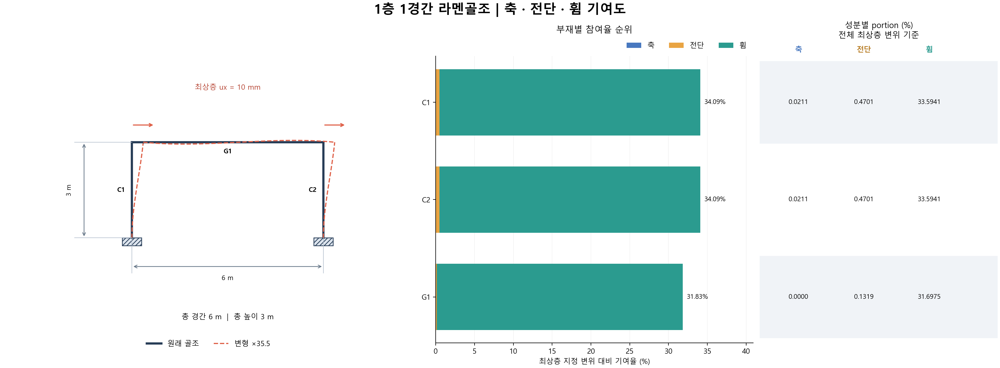
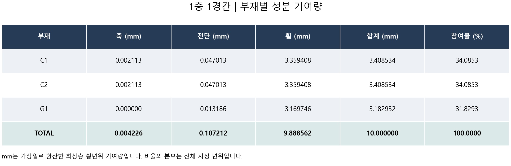

# 1층 1경간 결과

절점 4개 · 부재 3개 · 자유도 12개

최상층 모든 절점 ux=10 mm. 중간층 수평변위 및 모든 상부 절점의 uy·회전은 해석으로 결정합니다.

수평 구동력 합: **80.363989 kN**. 최대 참여 부재: **C1, C2**, 각각 **34.0853%**.

## 부재별 축·전단·휨 기여도

| 부재 | 축 (mm) | 전단 (mm) | 휨 (mm) | 합계 (mm) | 참여율 (%) |
|---|---:|---:|---:|---:|---:|
| C1 | 0.002113 | 0.047013 | 3.359408 | 3.408534 | 34.0853 |
| C2 | 0.002113 | 0.047013 | 3.359408 | 3.408534 | 34.0853 |
| G1 | 0.000000 | 0.013186 | 3.169746 | 3.182932 | 31.8293 |
| TOTAL | 0.004226 | 0.107212 | 9.888562 | 10.000000 | 100.0000 |

## 층별 기여도

해당 층 기둥과 해당 층 상단 보를 묶은 집계입니다. 층간변위 자체의 기여도는 아닙니다.

| 부재 | 축 (mm) | 전단 (mm) | 휨 (mm) | 합계 (mm) | 참여율 (%) |
|---|---:|---:|---:|---:|---:|
| 1F | 0.004226 | 0.107212 | 9.888562 | 10.000000 | 100.0000 |
| TOTAL | 0.004226 | 0.107212 | 9.888562 | 10.000000 | 100.0000 |

## 성분별 portion (%)

전체 기준: 세 성분을 더하면 해당 부재 참여율입니다. 부재 내부 기준: 세 성분을 더하면 100%입니다.

| 부재 | 전체 기준 축 | 전체 기준 전단 | 전체 기준 휨 | 부재 내부 축 | 부재 내부 전단 | 부재 내부 휨 |
|---|---:|---:|---:|---:|---:|---:|
| C1 | 0.0211 | 0.4701 | 33.5941 | 0.0620 | 1.3793 | 98.5587 |
| C2 | 0.0211 | 0.4701 | 33.5941 | 0.0620 | 1.3793 | 98.5587 |
| G1 | 0.0000 | 0.1319 | 31.6975 | 0.0000 | 0.4143 | 99.5857 |

비율은 최상층 지정 변위 기준입니다. 각 C/G 번호의 위치는 그림과 member_map.csv를 참조하세요.

부재가 24개보다 많으면 상세 표 그림을 24개씩 나누어 저장합니다.

전단면적 As/A 기본값은 5/6인 예제 가정입니다. 해석 가정과 수정 방법은 MULTI_FRAME_GUIDE.md를 참조하세요.
