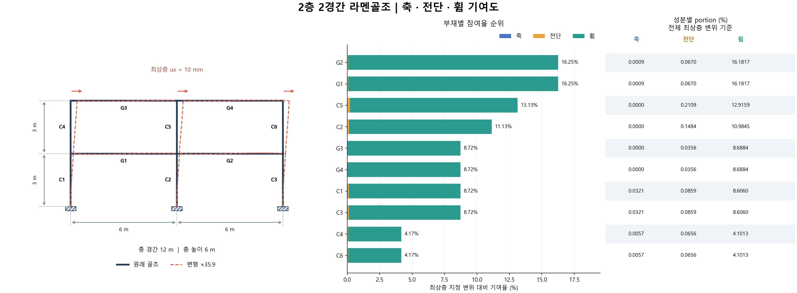
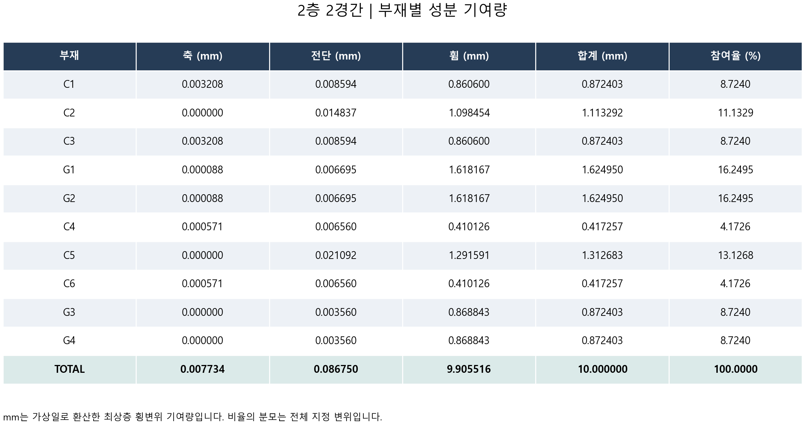

# 2층 2경간 결과

절점 9개 · 부재 10개 · 자유도 27개

최상층 모든 절점 ux=10 mm. 중간층 수평변위 및 모든 상부 절점의 uy·회전은 해석으로 결정합니다.

수평 구동력 합: **40.335266 kN**. 최대 참여 부재: **G1, G2**, 각각 **16.2495%**.

## 부재별 축·전단·휨 기여도

| 부재 | 축 (mm) | 전단 (mm) | 휨 (mm) | 합계 (mm) | 참여율 (%) |
|---|---:|---:|---:|---:|---:|
| C1 | 0.003208 | 0.008594 | 0.860600 | 0.872403 | 8.7240 |
| C2 | 0.000000 | 0.014837 | 1.098454 | 1.113292 | 11.1329 |
| C3 | 0.003208 | 0.008594 | 0.860600 | 0.872403 | 8.7240 |
| G1 | 0.000088 | 0.006695 | 1.618167 | 1.624950 | 16.2495 |
| G2 | 0.000088 | 0.006695 | 1.618167 | 1.624950 | 16.2495 |
| C4 | 0.000571 | 0.006560 | 0.410126 | 0.417257 | 4.1726 |
| C5 | 0.000000 | 0.021092 | 1.291591 | 1.312683 | 13.1268 |
| C6 | 0.000571 | 0.006560 | 0.410126 | 0.417257 | 4.1726 |
| G3 | 0.000000 | 0.003560 | 0.868843 | 0.872403 | 8.7240 |
| G4 | 0.000000 | 0.003560 | 0.868843 | 0.872403 | 8.7240 |
| TOTAL | 0.007734 | 0.086750 | 9.905516 | 10.000000 | 100.0000 |

## 층별 기여도

해당 층 기둥과 해당 층 상단 보를 묶은 집계입니다. 층간변위 자체의 기여도는 아닙니다.

| 부재 | 축 (mm) | 전단 (mm) | 휨 (mm) | 합계 (mm) | 참여율 (%) |
|---|---:|---:|---:|---:|---:|
| 1F | 0.006593 | 0.045417 | 6.055988 | 6.107998 | 61.0800 |
| 2F | 0.001141 | 0.041333 | 3.849528 | 3.892002 | 38.9200 |
| TOTAL | 0.007734 | 0.086750 | 9.905516 | 10.000000 | 100.0000 |

## 성분별 portion (%)

전체 기준: 세 성분을 더하면 해당 부재 참여율입니다. 부재 내부 기준: 세 성분을 더하면 100%입니다.

| 부재 | 전체 기준 축 | 전체 기준 전단 | 전체 기준 휨 | 부재 내부 축 | 부재 내부 전단 | 부재 내부 휨 |
|---|---:|---:|---:|---:|---:|---:|
| C1 | 0.0321 | 0.0859 | 8.6060 | 0.3678 | 0.9851 | 98.6471 |
| C2 | 0.0000 | 0.1484 | 10.9845 | 0.0000 | 1.3327 | 98.6673 |
| C3 | 0.0321 | 0.0859 | 8.6060 | 0.3678 | 0.9851 | 98.6471 |
| G1 | 0.0009 | 0.0670 | 16.1817 | 0.0054 | 0.4120 | 99.5826 |
| G2 | 0.0009 | 0.0670 | 16.1817 | 0.0054 | 0.4120 | 99.5826 |
| C4 | 0.0057 | 0.0656 | 4.1013 | 0.1367 | 1.5722 | 98.2910 |
| C5 | 0.0000 | 0.2109 | 12.9159 | 0.0000 | 1.6068 | 98.3932 |
| C6 | 0.0057 | 0.0656 | 4.1013 | 0.1367 | 1.5722 | 98.2910 |
| G3 | 0.0000 | 0.0356 | 8.6884 | 0.0000 | 0.4081 | 99.5919 |
| G4 | 0.0000 | 0.0356 | 8.6884 | 0.0000 | 0.4081 | 99.5919 |

비율은 최상층 지정 변위 기준입니다. 각 C/G 번호의 위치는 그림과 member_map.csv를 참조하세요.

부재가 24개보다 많으면 상세 표 그림을 24개씩 나누어 저장합니다.

전단면적 As/A 기본값은 5/6인 예제 가정입니다. 해석 가정과 수정 방법은 MULTI_FRAME_GUIDE.md를 참조하세요.
