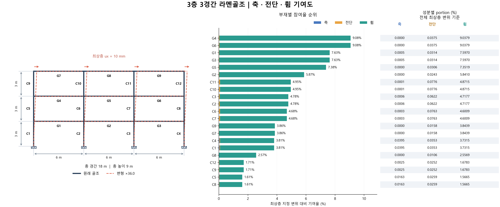
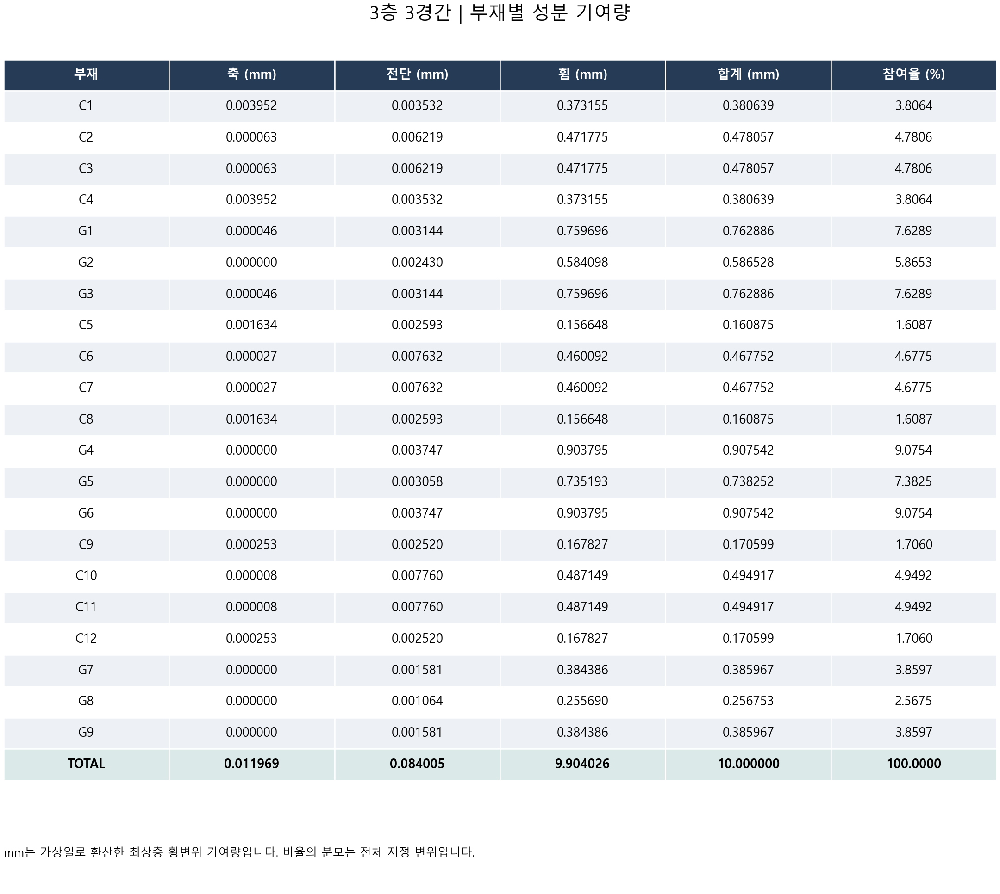

# 3층 3경간 결과

절점 16개 · 부재 21개 · 자유도 48개

최상층 모든 절점 ux=10 mm. 중간층 수평변위 및 모든 상부 절점의 uy·회전은 해석으로 결정합니다.

수평 구동력 합: **32.688586 kN**. 최대 참여 부재: **G4, G6**, 각각 **9.0754%**.

## 부재별 축·전단·휨 기여도

| 부재 | 축 (mm) | 전단 (mm) | 휨 (mm) | 합계 (mm) | 참여율 (%) |
|---|---:|---:|---:|---:|---:|
| C1 | 0.003952 | 0.003532 | 0.373155 | 0.380639 | 3.8064 |
| C2 | 0.000063 | 0.006219 | 0.471775 | 0.478057 | 4.7806 |
| C3 | 0.000063 | 0.006219 | 0.471775 | 0.478057 | 4.7806 |
| C4 | 0.003952 | 0.003532 | 0.373155 | 0.380639 | 3.8064 |
| G1 | 0.000046 | 0.003144 | 0.759696 | 0.762886 | 7.6289 |
| G2 | 0.000000 | 0.002430 | 0.584098 | 0.586528 | 5.8653 |
| G3 | 0.000046 | 0.003144 | 0.759696 | 0.762886 | 7.6289 |
| C5 | 0.001634 | 0.002593 | 0.156648 | 0.160875 | 1.6087 |
| C6 | 0.000027 | 0.007632 | 0.460092 | 0.467752 | 4.6775 |
| C7 | 0.000027 | 0.007632 | 0.460092 | 0.467752 | 4.6775 |
| C8 | 0.001634 | 0.002593 | 0.156648 | 0.160875 | 1.6087 |
| G4 | 0.000000 | 0.003747 | 0.903795 | 0.907542 | 9.0754 |
| G5 | 0.000000 | 0.003058 | 0.735193 | 0.738252 | 7.3825 |
| G6 | 0.000000 | 0.003747 | 0.903795 | 0.907542 | 9.0754 |
| C9 | 0.000253 | 0.002520 | 0.167827 | 0.170599 | 1.7060 |
| C10 | 0.000008 | 0.007760 | 0.487149 | 0.494917 | 4.9492 |
| C11 | 0.000008 | 0.007760 | 0.487149 | 0.494917 | 4.9492 |
| C12 | 0.000253 | 0.002520 | 0.167827 | 0.170599 | 1.7060 |
| G7 | 0.000000 | 0.001581 | 0.384386 | 0.385967 | 3.8597 |
| G8 | 0.000000 | 0.001064 | 0.255690 | 0.256753 | 2.5675 |
| G9 | 0.000000 | 0.001581 | 0.384386 | 0.385967 | 3.8597 |
| TOTAL | 0.011969 | 0.084005 | 9.904026 | 10.000000 | 100.0000 |

## 층별 기여도

해당 층 기둥과 해당 층 상단 보를 묶은 집계입니다. 층간변위 자체의 기여도는 아닙니다.

| 부재 | 축 (mm) | 전단 (mm) | 휨 (mm) | 합계 (mm) | 참여율 (%) |
|---|---:|---:|---:|---:|---:|
| 1F | 0.008123 | 0.028219 | 3.793349 | 3.829691 | 38.2969 |
| 2F | 0.003323 | 0.031003 | 3.776263 | 3.810589 | 38.1059 |
| 3F | 0.000523 | 0.024784 | 2.334413 | 2.359720 | 23.5972 |
| TOTAL | 0.011969 | 0.084005 | 9.904026 | 10.000000 | 100.0000 |

## 성분별 portion (%)

전체 기준: 세 성분을 더하면 해당 부재 참여율입니다. 부재 내부 기준: 세 성분을 더하면 100%입니다.

| 부재 | 전체 기준 축 | 전체 기준 전단 | 전체 기준 휨 | 부재 내부 축 | 부재 내부 전단 | 부재 내부 휨 |
|---|---:|---:|---:|---:|---:|---:|
| C1 | 0.0395 | 0.0353 | 3.7315 | 1.0383 | 0.9278 | 98.0339 |
| C2 | 0.0006 | 0.0622 | 4.7177 | 0.0132 | 1.3008 | 98.6860 |
| C3 | 0.0006 | 0.0622 | 4.7177 | 0.0132 | 1.3008 | 98.6860 |
| C4 | 0.0395 | 0.0353 | 3.7315 | 1.0383 | 0.9278 | 98.0339 |
| G1 | 0.0005 | 0.0314 | 7.5970 | 0.0061 | 0.4121 | 99.5818 |
| G2 | 0.0000 | 0.0243 | 5.8410 | 0.0000 | 0.4143 | 99.5857 |
| G3 | 0.0005 | 0.0314 | 7.5970 | 0.0061 | 0.4121 | 99.5818 |
| C5 | 0.0163 | 0.0259 | 1.5665 | 1.0156 | 1.6120 | 97.3724 |
| C6 | 0.0003 | 0.0763 | 4.6009 | 0.0058 | 1.6316 | 98.3626 |
| C7 | 0.0003 | 0.0763 | 4.6009 | 0.0058 | 1.6316 | 98.3626 |
| C8 | 0.0163 | 0.0259 | 1.5665 | 1.0156 | 1.6120 | 97.3724 |
| G4 | 0.0000 | 0.0375 | 9.0379 | 0.0000 | 0.4129 | 99.5871 |
| G5 | 0.0000 | 0.0306 | 7.3519 | 0.0000 | 0.4143 | 99.5857 |
| G6 | 0.0000 | 0.0375 | 9.0379 | 0.0000 | 0.4129 | 99.5871 |
| C9 | 0.0025 | 0.0252 | 1.6783 | 0.1485 | 1.4769 | 98.3746 |
| C10 | 0.0001 | 0.0776 | 4.8715 | 0.0017 | 1.5679 | 98.4304 |
| C11 | 0.0001 | 0.0776 | 4.8715 | 0.0017 | 1.5679 | 98.4304 |
| C12 | 0.0025 | 0.0252 | 1.6783 | 0.1485 | 1.4769 | 98.3746 |
| G7 | 0.0000 | 0.0158 | 3.8439 | 0.0000 | 0.4095 | 99.5905 |
| G8 | 0.0000 | 0.0106 | 2.5569 | 0.0000 | 0.4143 | 99.5857 |
| G9 | 0.0000 | 0.0158 | 3.8439 | 0.0000 | 0.4095 | 99.5905 |

비율은 최상층 지정 변위 기준입니다. 각 C/G 번호의 위치는 그림과 member_map.csv를 참조하세요.

부재가 24개보다 많으면 상세 표 그림을 24개씩 나누어 저장합니다.

전단면적 As/A 기본값은 5/6인 예제 가정입니다. 해석 가정과 수정 방법은 MULTI_FRAME_GUIDE.md를 참조하세요.
