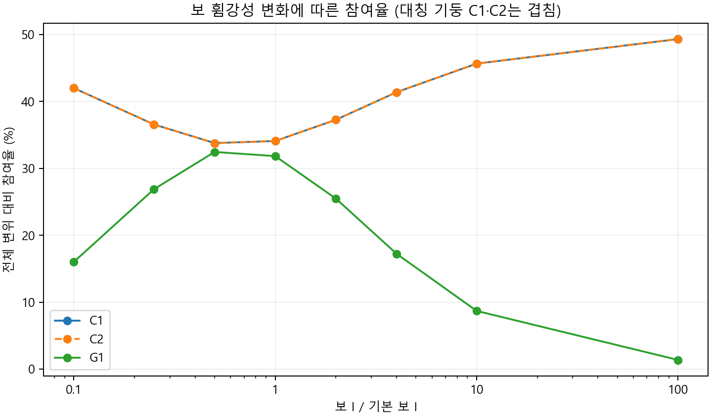

# 축·전단·휨 변형 기여도

전체 지정 수평변위에 대한 가상일 환산 기여량입니다. 비율의 분모는 전체 변위입니다.

| 부재 | 축 (mm) | 전단 (mm) | 휨 (mm) | 합계 (mm) | 참여율 (%) |
|---|---:|---:|---:|---:|---:|
| C1 | 0.002113 | 0.047013 | 3.359408 | 3.408534 | 34.0853 |
| C2 | 0.002113 | 0.047013 | 3.359408 | 3.408534 | 34.0853 |
| G1 | 0.000000 | 0.013186 | 3.169746 | 3.182932 | 31.8293 |
| TOTAL | 0.004226 | 0.107212 | 9.888562 | 10.000000 | 100.0000 |

## 전체 변위 대비 성분별 비율

| 부재 | 축 (%) | 전단 (%) | 휨 (%) | 합계 (%) |
|---|---:|---:|---:|---:|
| C1 | 0.0211 | 0.4701 | 33.5941 | 34.0853 |
| C2 | 0.0211 | 0.4701 | 33.5941 | 34.0853 |
| G1 | 0.0000 | 0.1319 | 31.6975 | 31.8293 |
| TOTAL | 0.0423 | 1.0721 | 98.8856 | 100.0000 |

경간 6 m · 높이 3 m · 지정 변위 10 mm · 수평 반력 합 80.3640 kN

C1: 왼쪽 기둥, C2: 오른쪽 기둥, G1: 보.

